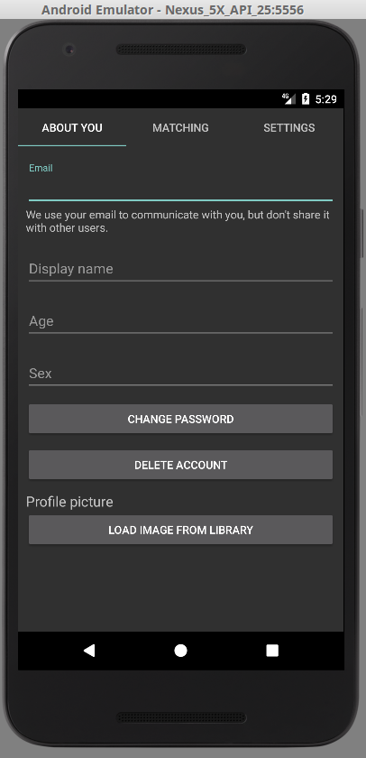

## YamlSample

Sample app.

### Instructions to write an app like this

* add `android:theme="@style/Theme.AppCompat"` in [AndroidManifest.xml](app/src/main/AndroidManifest.xml)
* add [settings.yaml](app/src/main/res/raw/settings.yaml) in res/raw
* add a `com.github.abe_winter.yaml_settings.YamlSettings` tag in your [view file](app/src/main/res/layout/activity_main.xml)
* add the jitpack repo & yaml-settings dependency in [build.gradle](app/build.gradle) (it's at the very bottom)

### Screenshot

